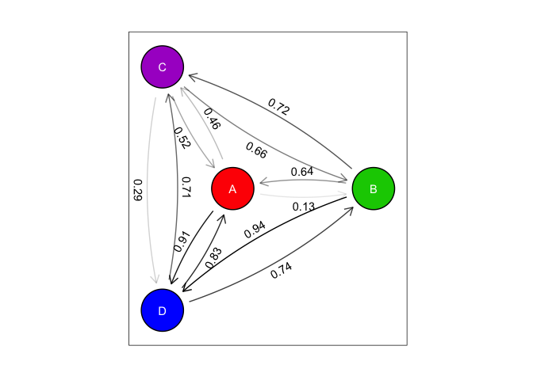

ggraph demo
================
Hao Ye
2017 May 31

Setup (required packages)
-------------------------

``` r
library(ggraph)
library(igraph)
library(dplyr)
```

Create the Network
------------------

Create the data for the directed, weighted graph (4 nodes)

``` r
set.seed(42) # for reproducibility
adj_df <- expand.grid(from = LETTERS[1:4], 
                      to = LETTERS[1:4]) %>%
    filter(from != to)
adj_df$wt <- runif(NROW(adj_df))
```

Create the data structure for the graph and add appropriate metadata

``` r
g <- graph_from_data_frame(adj_df[, c("from", "to")])
E(g)$weight <- format(adj_df$wt, digits = 2)
V(g)$name <- LETTERS[1:4]
V(g)$color <- c("red", "green", "purple", "blue")
```

Plot
----

Make the figure

``` r
node_size <- 0.15 # size of the nodes

my_plot <- ggraph(g, layout = "star", center = "A") + 
    geom_edge_fan(aes(label = weight, alpha = weight), 
                  show.legend = FALSE, 
                  angle_calc = "along", 
                  label_dodge = unit(-3, "mm"), 
                  arrow = arrow(length = unit(3, "mm")), 
                  start_cap = circle(node_size/1.5, "npc"), 
                  end_cap = circle(node_size/1.5, "snpc")) + 
    geom_node_circle(aes(r = node_size, fill = color), show.legend = FALSE) + 
    geom_node_text(aes(label = name), color = "white") + 
    scale_fill_manual(values = c("blue" = "#0000FF", 
                                 "red" = "#FF0000", 
                                 "green" = "#00CC00", 
                                 "purple" = "#AA00CC")) + 
    theme_graph(foreground = 'black', fg_text_colour = 'white') + 
    coord_fixed() # makes circles actual circles

print(my_plot)
```


