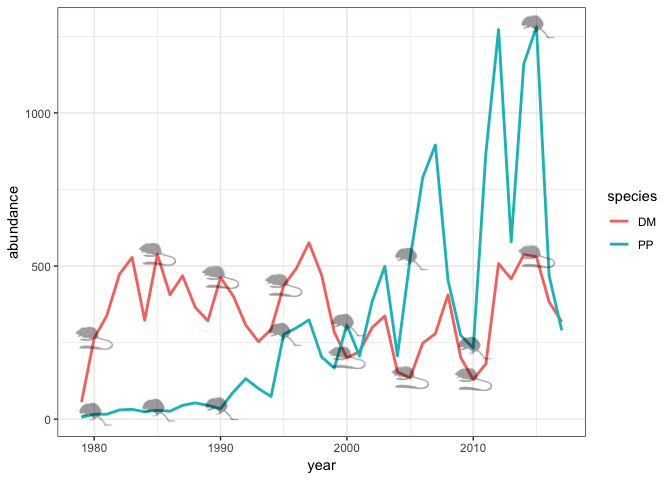

Rodent Abundance with Profile Pics
================
Hao Ye
8/16/2018

Setup
-----

We are going to use all of these packages

``` r
# devtools::install_github("weecology/portalr")
# devtools::install_github("sckott/rphylopic")

library(portalr)
library(dplyr)
```

    ## 
    ## Attaching package: 'dplyr'

    ## The following objects are masked from 'package:stats':
    ## 
    ##     filter, lag

    ## The following objects are masked from 'package:base':
    ## 
    ##     intersect, setdiff, setequal, union

``` r
library(ggplot2)
library(rphylopic)
library(lubridate)
```

    ## 
    ## Attaching package: 'lubridate'

    ## The following object is masked from 'package:base':
    ## 
    ##     date

``` r
library(png)
```

Data
----

Getting annual counts of DM and PP:

``` r
dat <- abundance(shape = "long", time = "date") %>%
    filter(species %in% c("DM", "PP")) %>%
    mutate(year = year(as.Date(censusdate))) %>%
    group_by(year, species) %>%
    summarize(abundance = sum(abundance))
```

    ## Joining, by = c("month", "day", "year", "period", "plot")

    ## Joining, by = "period"

    ## Joining, by = c("year", "month", "plot")

Read in the profile images:

``` r
dm <- readPNG("dipodomys_merriami.png")
pp <- readPNG("chaetodipus_penicillatus.png")
```

Plot
----

Line plot for abundance by species by year:

``` r
p <- ggplot(dat, aes(x = year, y = abundance, color = species)) + 
    geom_line(size = 1) + 
    theme_bw()
```

Add in rodent profile pics:

``` r
for (yr in seq(from = 1980, to = 2015, by = 5))
{
    dm_abundance <- filter(dat, year == yr, species == "DM") %>%
        pull(abundance)
    p <- p + add_phylopic(dm, x = yr, y = dm_abundance, ysize = 80, alpha = 0.4)
    pp_abundance <- filter(dat, year == yr, species == "PP") %>%
        pull(abundance)
    p <- p + add_phylopic(pp, x = yr, y = pp_abundance, ysize = 80, alpha = 0.4)
}
```

Final plot:

``` r
print(p)
```


