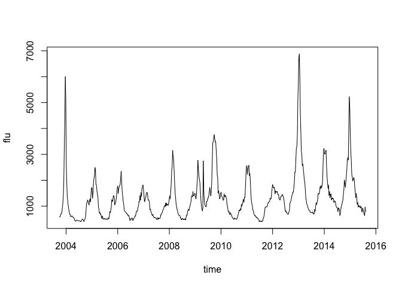
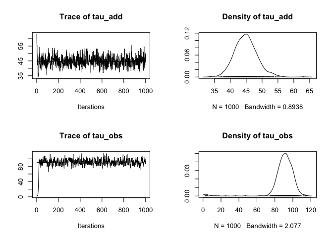
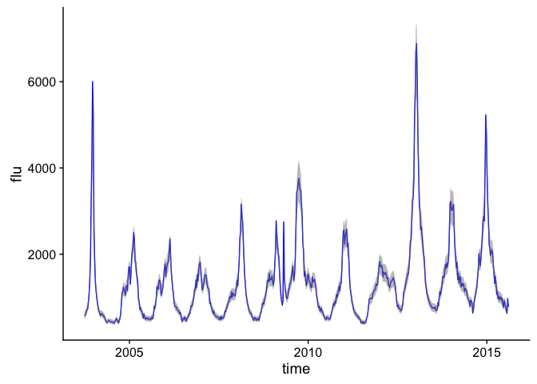

Google Flu Random Walk State-Space Model
================
Hao Ye
2017, November 19

From <https://github.com/weecology/forecasting-dynamics-course/>

# Basic Setup

Get the
    data

``` r
library(tidyverse)
```

    ## Warning: package 'tidyverse' was built under R version 3.4.2

    ## ── Attaching packages ─────────────────────────────────────────────────── tidyverse 1.2.1 ──

    ## ✔ ggplot2 2.2.1.9000     ✔ purrr   0.2.4     
    ## ✔ tibble  1.3.4          ✔ dplyr   0.7.4     
    ## ✔ tidyr   0.7.2          ✔ stringr 1.2.0     
    ## ✔ readr   1.1.1          ✔ forcats 0.2.0

    ## Warning: package 'tidyr' was built under R version 3.4.2

    ## Warning: package 'purrr' was built under R version 3.4.2

    ## Warning: package 'dplyr' was built under R version 3.4.2

    ## ── Conflicts ────────────────────────────────────────────────────── tidyverse_conflicts() ──
    ## ✖ dplyr::filter() masks stats::filter()
    ## ✖ dplyr::lag()    masks stats::lag()

``` r
flu_file <- "https://www.google.org/flutrends/about/data/flu/us/data.txt"
flu_data <- read_csv(flu_file, skip = 11)
```

    ## Parsed with column specification:
    ## cols(
    ##   .default = col_integer(),
    ##   Date = col_date(format = "")
    ## )

    ## See spec(...) for full column specifications.

Simple plot for Florida:

``` r
time <- as.Date(flu_data$Date)
flu <- flu_data$Florida

plot(time, flu, type = "l")
```

<!-- -->

# Model Definition

Process Model:
\[ x_{t+1} = x_t + \phi_{add} \\ \phi_{add} \sim \mathcal{N}(0, \sigma_{add})\]

Observation Model:
\[ y_t = x_t + \phi_{obs}\\ \phi_{obs} \sim \mathcal{N}(0, \sigma_{obs})\]

# Model Fitting

Set up model

``` r
library(rjags)
```

    ## Loading required package: coda

    ## Linked to JAGS 4.3.0

    ## Loaded modules: basemod,bugs

``` r
random_walk <- "
  model{
  # observation model
  for(i in 1:n){
    y[i] ~ dnorm(x[i], tau_obs) # note tau is precision (inverse of variance)
  }

  # process model
  for(i in 2:n){
    x[i] ~ dnorm(x[i-1], tau_add)
  }

  # priors
  x[1] ~ dnorm(x_ic, tau_ic)
  tau_obs ~ dgamma(a_obs, r_obs)
  tau_add ~ dgamma(a_add, r_add)
}
"

dat <- list(y = log(flu), n = length(flu), 
            x_ic = log(flu[1]), tau_ic = 1/var(log(flu)), 
            a_obs = 1, r_obs = 1, 
            a_add = 1, r_add = 1)

init <- list(list(tau_obs = 5/var(log(flu)), 
                  tau_add = 1/var(diff(log(flu)))))
```

Create JAGS model object

``` r
model <- jags.model(file = textConnection(random_walk), 
                    data = dat, 
                    init = init, 
                    n.chains = 1)
```

    ## Compiling model graph
    ##    Resolving undeclared variables
    ##    Allocating nodes
    ## Graph information:
    ##    Observed stochastic nodes: 620
    ##    Unobserved stochastic nodes: 622
    ##    Total graph size: 1249
    ## 
    ## Initializing model

Run JAGS MCMC

``` r
output <- coda.samples(model = model, 
                       variable.names = c("tau_add", "tau_obs"), 
                       n.iter = 1000)
```

View output

``` r
plot(output)
```

<!-- -->

Run JAGS MCMC

``` r
output <- coda.samples(model = model, 
                       variable.names = c("tau_add", "tau_obs", "x"), 
                       n.iter = 10000)
```

Transform output for viewing

``` r
obs_data <- data.frame(time, flu)

out <- as.matrix(output)
x_est <- exp(out[, 3:NCOL(out)])
pred_data <- data.frame(t(x_est))

# generate summary values over MCMC samples
pred_data %>%
    mutate(time = time) %>%
    gather(rep, flu, -time) %>%
    group_by(time) %>%
    summarize(mu = mean(flu), 
              med = median(flu), 
              sd = sd(flu), 
              upper = quantile(flu, 0.95), 
              lower = quantile(flu, 0.05)) %>%
    {.} -> pred_summary
```

``` r
p <- ggplot(obs_data, aes(x = time, y = flu)) + 
    geom_line(color = "blue") + 
    cowplot::theme_cowplot() + 
    geom_ribbon(aes(x = time, ymin = lower, ymax = upper), 
                data = pred_summary, fill = rgb(0.5, 0.5, 0.5, 0.5))

print(p)
```

<!-- -->
